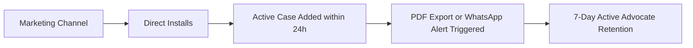

# ⚖️ Advocase: Complete Product Marketing & Advocate Collateral Playbook

> **App Name:** Advocase (CaseDiary)  
> **Package ID:** `com.iamshiv.CaseDiary`  
> **Tagline:** *"Apna Digital Court Munshi — Manage Cases, Cause Lists & Clients Anywhere, 100% Offline."*  
> **Target Audience:** Indian Advocates, Independent Litigators, Chamber Associates, District & High Court Lawyers, Legal Clerks.  
> **Document Purpose:** Complete end-to-end marketing kit containing video production storyboards, social media copy, WhatsApp outreach templates, Bar Association campaign collateral, printable flyers, and objection-handling scripts to scale advocate adoption.

---

## 📑 Table of Contents
1. [Product Positioning & Value Propositions](#1-product-positioning--value-propositions)
2. [Target Advocate Personas & Pitch Angles](#2-target-advocate-personas--pitch-angles)
3. [Core Feature Matrix & Benefit Breakdown](#3-core-feature-matrix--benefit-breakdown)
4. [Video Production Scripts & Storyboards (Full Production Ready)](#4-video-production-scripts--storyboards)
   - *Video 1: The 60-90s Hero Brand Film ("From Paper Chaos to Digital Power")*
   - *Video 2: 30s High-Conversion Instagram Reel / YouTube Short ("Basement Courtroom")*
   - *Video 3: 45s Feature Spotlight ("1-Click WhatsApp Client Updates")*
   - *Video 4: 3-Minute Master Walkthrough / Chamber Onboarding Video*
5. [Advocate Outreach & WhatsApp Marketing Collateral](#5-advocate-outreach--whatsapp-marketing-collateral)
   - *Direct 1-on-1 Colleague Message*
   - *Bar Association Group Broadcasts*
   - *Chamber Junior / Associate Invite Message*
6. [Print Collateral & Field Marketing Assets](#6-print-collateral--field-marketing-assets)
   - *1-Page Bar Association Library / Canteen Flyer*
   - *Table Standee / Chamber Reception Card Copy*
7. [Social Media Campaign Assets & Content Calendar](#7-social-media-campaign-assets--content-calendar)
   - *LinkedIn Authority Posts*
   - *Instagram Carousels & Reels Hooks*
   - *Relatable Legal Memes & Humorous Hooks*
8. [Bar Association Offline Activation Playbook](#8-bar-association-offline-activation-playbook)
   - *10-Minute Chamber Pitch Script*
   - *Free 15-Minute "Digital Chamber" Workshop Outline*
9. [Advocate FAQ & Objection Handling Guide](#9-advocate-faq--objection-handling-guide)
10. [Measurement & Conversion KPI Framework](#10-measurement--conversion-kpi-framework)

---

## 1. Product Positioning & Value Propositions

### 🎯 Core Positioning Statement
> For Indian trial and appellate lawyers burdened by heavy physical paper diaries, missed hearing dates, and endless manual client calls, **Advocase** is the smart, offline-first mobile legal diary that organizes daily cause lists, court notes, and automated client WhatsApp alerts in one tap. Unlike generic calendar apps or expensive desktop firm software, Advocase is engineered specifically for Indian court workflows—working seamlessly inside basement courtrooms with zero internet and keeping your client data 100% private.

### 💎 The 5 Core Pillars (USPs)
1. **100% Offline-First Privacy:** Works inside basement courtrooms, rural courts, and transit with zero network. SQLite on-device encryption ensures client confidentiality is never compromised.
2. **Instant Daily Cause List & PDF Generation:** Automatically organizes today’s hearings by court number and serial priority. Exports a crisp, professional PDF in 1 tap for chamber juniors and clerks.
3. **Automated Client WhatsApp Updates:** With a single tap after hearing, sends a personalized WhatsApp update to the client with the next date, purpose, and judge without typing.
4. **Never Lose a Case ("Undated & Yesterday's Tracker"):** Dedicated filters catch undated matters and yesterday's unattended hearings so no case slips through the cracks.
5. **In-App Legal Toolkit (Drafting, OCR, Audio Notes):** Ready-to-use Indian legal draft templates (Vakalatnama, Bail, Exemption, RTI), legal vocabulary auto-complete, OCR document scanning, and speech-to-text case notes.

---

## 2. Target Advocate Personas & Pitch Angles

### Persona A: The Busy District Court Litigator ("Advocate Sharma Ji", 42)
* **Practice:** 15–25 active hearings per week across District & Sessions Court, CJM, and Civil Judge courts.
* **Pain Points:** 
  - Carrying a heavy leatherbound physical diary everywhere.
  - Page-flipping panic when a judge asks for the previous order date.
  - Spending 2 hours every evening answering phone calls from clients asking *"Sir, aaj case me kya hua?"*
* **Pitch Hook:** *"Sir, leave the 2 kg red diary at home. Get your morning cause list on your phone and update 20 clients on WhatsApp in 60 seconds."*

### Persona B: The High Court Chamber Associate / Junior Advocate ("Advocate Priya", 28)
* **Pain Points:** 
  - Preparing cause lists every night at 10 PM for senior counsel.
  - Coordinating case status between courtrooms across different floors.
  - Drafting urgency memos, exemption applications, and keeping track of court serial numbers.
* **Pitch Hook:** *"Generate your Senior's daily cause list PDF in 5 seconds flat. Share it directly to your chamber WhatsApp group."*

### Persona C: The Independent Solo Practitioner / Young Litigator ("Advocate Rahul", 31)
* **Pain Points:** 
  - Cannot afford ₹25,000/year enterprise law firm software.
  - Needs fee collection tracking (advocate fees agreed vs. received).
  - Struggles with client management and document organization without a full-time clerk.
* **Pitch Hook:** *"Your personal digital munshi for ₹0. Manage unlimited cases, track unpaid fees, and scan case orders straight from your phone."*

---

## 3. Core Feature Matrix & Benefit Breakdown

| Feature Module | In-App Capability | Advocate Real-World Benefit | Proof Point in App |
| :--- | :--- | :--- | :--- |
| **Daily Court Diary** | Categorized into Today, Tomorrow, Calendar, & Undated. | Instant snapshot of today's battlefield before stepping out of home. | 7:30 AM morning notification alert with hearing counts. |
| **Instant WhatsApp Alerts** | 1-Click WhatsApp modal with pre-filled case title, CNR, Next Date, Court, and Advocate name. | Eliminates 20+ repetitive client phone calls every evening. Saves 1.5 hours daily. | Directly triggers WhatsApp with client contact from SQLite. |
| **Cause List PDF Exporter** | Generates professional print-ready Cause List PDF with advocate name, bar council enrollment, and serial numbers. | Hand clean cause lists to court clerks, peons, or chamber seniors in seconds. | Styled PDF generation with print/share action sheet. |
| **Yesterday’s Cases Review** | Automatic queue of hearings from yesterday that require status updates. | Guarantees no matter is forgotten even during hectic back-to-back trial days. | Prominent dashboard indicator for unresolved past dates. |
| **Legal Document Templates** | Ready drafting templates: Bail Applications, Vakalatnama, Exemption, RTI, Section 138 Notices. | Draft urgent applications on mobile inside court canteen using rich text editor. | Tiptap rich text legal editor with placeholder auto-fill. |
| **Speech-to-Text & Notes** | Voice recording transcribing arguments and oral remarks into case notes. | Capture judge's verbal observations immediately after arguing the matter. | Speech recognition integration with legal vocabulary suggestions. |
| **Financial & Fee Tracking** | Agreed fee vs. received fee breakdown with payment mode records. | Prevent revenue leakage; instantly know pending client dues. | Fee progress bar on every case details card. |
| **Google Drive Backup** | Encrypted SQLite backup & restore to user's private Google Drive. | 100% peace of mind. Change phones or lose a handset with zero data loss. | 1-Tap Google Drive export/import in Settings. |

---

## 4. Video Production Scripts & Storyboards

---

### 🎬 Video 1: The Hero Brand Film (60–90 Seconds)
**Title:** *"The Day Everything Changed for Advocate Sharma"*  
**Format:** 16:9 (YouTube, Bar Association Presentations, Website) & 9:16 (Instagram Reels, Shorts)  
**Tone:** Relatable, Empathetic, Professional, Triumphant.  
**Language:** Hinglish (Authentic Indian Court Atmosphere).

#### Shot-by-Shot Storyboard

| Time | Visual / Shot Description | Audio / Voiceover (VO) | On-Screen Text / Graphics |
| :--- | :--- | :--- | :--- |
| **00:00 - 00:08** | **Scene 1:** Fast-paced morning chaos. A busy advocate's desk piled with red cloth files (*bastas*), sticky notes, and thick paper diaries. A phone rings non-stop with client calls. | **VO (Relatable, stressed):** *"Subah ke 8 baje hain... 3 alag-alag courts me 12 hearings hain... aur physical diary ke panne palat-palat kar dhoondh rahe hain ki Court No. 4 me kaunsa case pehle lagega?"* | ❌ Paper Diary Chaos<br>❌ 15 Missed Client Calls |
| **00:08 - 00:16** | **Scene 2:** Advocate rushing down court corridors in black coat, sweating, diary almost slipping under arm. Inside the courtroom, judge asks: *"Counsel, what was the last order date?"* Advocate fumbles through 300 pages. | **VO:** *"Judge sahab ne poocha last hearing date, aur aap 2 minute tak diary ke panne palat rahe hain... Client ka phone alag se vibrate kar raha hai!"* | ⏳ Time Wasted in Court |
| **00:16 - 00:26** | **Scene 3:** Hard cut to a modern, calm advocate sitting comfortably in the Bar Association library. He opens **Advocase** on his phone. Crisp dark mode interface displays *"Today's Hearings: 8 Cases"*. | **VO (Confident, energetic):** *"Ab band kijiye 100 saal purana tareeqa. Meet **Advocase** — Har Indian Advocate ka apna Digital Court Munshi!"* | ⚖️ **Advocase**<br>The Digital Court Munshi |
| **00:26 - 00:38** | **Scene 4 (Feature Blitz):** Screen recording of Advocase: <br>1. Tap to view today's cause list organized by Court & Item No.<br>2. Tap *"Export PDF"* — instant elegant Cause List ready to print or WhatsApp.<br>3. Voice dictation recording judge's order. | **VO:** *"Subah uthte hi aapka customized Cause List taiyaar! Ek tap me PDF export kijiye apne junior ya clerk ke liye. Aur court ke bahar aate hi voice note me judge sahab ke remarks save kijiye."* | 📄 1-Tap Cause List PDF<br>🎙️ Voice Case Notes |
| **00:38 - 00:50** | **Scene 5:** Advocate clicks *"Update Hearing"*. Selects Next Date: 18th Oct. Clicks *"WhatsApp Client"*. WhatsApp opens automatically with a pre-typed professional message with CNR, Court, and Date. Client receives it instantly and replies *"Thank you, Sir!"*. | **VO:** *"Sabse bada sar-dard: Client updates! Hearing khatam hote hi 1-Click WhatsApp notification bhejiye. Na typing ki jhanjhat, na shaam ko 50 calls uthane ka tension!"* | 📲 1-Click WhatsApp Client Alerts<br>*(No Manual Typing)* |
| **00:50 - 01:02** | **Scene 6:** Advocate walking into courtroom basement. Screen shows *"Offline Mode - 100% Data Available"*. Case details, previous orders, and FIR numbers open instantaneously without lag. | **VO:** *"Court basement me zero network? Fikr mat kijiye! Advocase 100% offline kaam karta hai. Aapka data aapke phone me bilkul safe aur encrypted."* | 📶 100% Offline<br>🔒 Zero Internet Needed |
| **01:02 - 01:15** | **Scene 7:** Advocate smiling, shaking hands with a satisfied client outside the High Court gate. App logo animates on screen with download badge. | **VO:** *"Apni legal practice ko banaiye smart, professional aur paperless. Aaj hi download kijiye Advocase from Google Play Store!"* | **Download Advocase Now**<br>Free on Google Play Store<br>⭐️ 4.8+ Rated by Advocates |

---

### 🎬 Video 2: The 30-Second High-Impact Reel / YouTube Short
**Title:** *"What Lawyers Do When There's No Network in Court"*  
**Hook:** Extreme pain point callout in the first 2 seconds.  
**Platform:** Instagram Reels, YouTube Shorts, WhatsApp Status.

* **[00:00 - 00:04] Hook (Face to Camera or Dramatic Court Visual):**  
  Actor/Advocate taps phone furiously in court basement:  
  *On-Screen Text:* **"POV: You need your case notes in court basement but network is 0..."**  
  *Audio:* Tense clock ticking SFX.
* **[00:04 - 00:10] Agony:**  
  "Cloud apps loading wheel ghoom raha hai... aur judge sahab bol rahe hain: *'Dismissed for non-prosecution!'*"
* **[00:10 - 00:18] Solution:**  
  "Isliye smart advocates switch kar chuke hain **Advocase** par! 100% OFFLINE. Court basement ho ya lockup — open case files, check past orders, and view documents instantly."
* **[00:18 - 00:25] Proof:**  
  Fast screen capture showing 0-second loading of case details, bail draft, and police station details.
* **[00:25 - 00:30] Call to Action (CTA):**  
  "Play Store se abhi install karo — Link in bio / Description. Search 'Advocase'!"

---

### 🎬 Video 3: 45-Second Feature Spotlight Reel
**Title:** *"How I Send Hearing Updates to 25 Clients in 2 Minutes Flat"*  
**Target:** Solving the #1 advocate daily headache: evening client calls.

* **[00:00 - 00:05] Hook:**  
  Advocate sitting exhausted at desk at 7:00 PM. Incoming call after incoming call.  
  *Text:* *"6:00 PM: 34 missed calls from clients asking 'Sir tareekh kya lagi?'"*
* **[00:05 - 00:15] The Secret:**  
  "Maine calls uthana band kar diya hai, aur mere clients pehle se zyada khush hain! Kaise? Watch this."
* **[00:15 - 00:30] Screen Demo:**  
  Advocate opens Advocase.  
  1. Opens Case: *Ramesh Kumar vs. State*.  
  2. Taps "Next Hearing Date": *Nov 24*.  
  3. Taps green **"Share to Client WhatsApp"** button.  
  4. WhatsApp automatically opens with a personalized message:  
     *"Dear Ramesh Kumar, your case Bail Matter (CNR: DLHC0100...) is scheduled on 24-Nov-2026 before Court No. 14. Regards, Adv. Vikram Singh."*  
  5. Hit Send. Time taken: 3 seconds!
* **[00:30 - 00:45] Outro & CTA:**  
  "Save 2 hours every single day. Client ko professional update milta hai aur aapka time bachta hai. Try **Advocase** today!"

---

### 🎬 Video 4: The 3-Minute Master Walkthrough / Chamber Training Video
**Usage:** Shared on Bar Association groups, YouTube tutorial link, and in-app Onboarding card.  
**Structure:**
1. **Chapter 1: Adding Your First Case (0:00 - 0:45)**  
   - Showing fast entry: Case Title, Court Name, CNR Number, Client Phone Number.  
   - Linking IPC / BNS Sections and Police Station from pre-loaded dropdowns.
2. **Chapter 2: Managing Daily Court Battles (0:45 - 1:30)**  
   - Checking "Today's Hearings".  
   - How "Yesterday's Cases" automatically prompts for forgotten updates.  
   - Finding "Undated Cases" so no file is ever archived by mistake.
3. **Chapter 3: Generating Cause List PDF (1:30 - 2:05)**  
   - 1-click filter for tomorrow's court list.  
   - Generating a formatted PDF with case title, item number, courtroom, and opposing counsel.  
   - Sharing directly to chamber juniors via WhatsApp / Telegram.
4. **Chapter 4: In-App Legal Drafting & Notes (2:05 - 2:35)**  
   - Opening pre-built Vakalatnama or Bail application template.  
   - Voice typing case notes immediately after oral arguments.
5. **Chapter 5: 100% Privacy & Cloud Backup (2:35 - 3:00)**  
   - Explaining SQLite local storage (no third-party server reading case files).  
   - Linking personal Google Drive for 1-tap encrypted backup.

---

## 5. Advocate Outreach & WhatsApp Marketing Collateral

---

### Template 1: Direct 1-on-1 Colleague / Peer Advocate Message
*Use this when introducing the app to colleague advocates, bar room friends, or batchmates.*

> **Subject / Headline:** Bhai/Sir, check this legal diary app — game changer for daily court work!  
>  
> Respected Colleague,  
>  
> Agar aap bhi court me physical red diary le ja kar pareshan hain ya sham ko clients ko tareekh batane me ghanton lagte hain, toh ek baar **Advocase** zaroor try kijiye.  
>  
> **Advocase kyu best hai?**  
> 1. 📶 **100% Offline** — Court basement me bhi chalta hai bina kisi internet ke.  
> 2. 📲 **1-Click WhatsApp Updates** — Hearing ke baad direct client ko automated professional message bhejo.  
> 3. 📄 **Daily Cause List PDF** — Subah 1 click me apna printed cause list nikalo apne juniors ke liye.  
> 4. ⚖️ **Never Miss a Date** — Undated cases aur yesterday's hearing tracker kabhi case chhootne nahi deta.  
> 5. 🔒 **Complete Privacy** — Saara data aapke phone me encrypted rehta hai.  
>  
> Maine khud use karna start kiya hai aur roz ka kam se kam 1-2 ghanta bachta hai.  
>  
> 📲 **Download Link:** https://play.google.com/store/apps/details?id=com.iamshiv.CaseDiary  
>  
> Ek baar install karke dekho, pasand aayega! 👍

---

### Template 2: Bar Association / Advocate WhatsApp Group Broadcast
*Designed to be posted in District Court / High Court Bar Association WhatsApp & Telegram groups.*

> ⚖️ **BAR MEMBERS KE LIYE NAYA DIGITAL TOOL — ADVOCASE** ⚖️  
>  
> Respected Senior & Colleague Advocates,  
>  
> Ab physical diary ke panne palatna aur heavy files carry karna band kijiye. Indian Courts aur Advocates ke liye specially design kiya gaya hai **Advocase (Digital Case Diary)**.  
>  
> ✨ **Key Highlights for Advocates:**  
> • 📅 **Daily Cause List on Mobile:** Court number aur item number wise organized.  
> • 🖨️ **Cause List PDF Export:** Junior advocates aur clerks ke sath 1-second me share karein.  
> • 💬 **Automated WhatsApp Hearing Updates:** Client ko next date aur case status turant bhejein.  
> • 🎙️ **Voice Case Notes:** Court ke bahar aate hi oral arguments aur order voice se note karein.  
> • 📝 **Ready Legal Templates:** Bail, Vakalatnama, Exemption drafts mobile me hi edit karein.  
> • 🛡️ **No Internet Required:** Works seamlessly inside courtrooms & lockups.  
>  
> 🇮🇳 Made specifically for Indian Advocates & Litigators.  
>  
> 📥 **Free Install on Google Play:**  
> 👉 https://play.google.com/store/apps/details?id=com.iamshiv.CaseDiary  
>  
> *Share this with your juniors and chamber associates to make your chamber 100% paperless!*

---

### Template 3: Senior Counsel to Junior / Chamber Associate Onboarding
*For senior advocates recommending the app to their entire chamber staff.*

> Dear Team,  
>  
> From this Monday, our chamber is moving all daily hearing schedules and court cause lists to **Advocase**.  
>  
> All associates and juniors please download the app on your phones:  
> 🔗 https://play.google.com/store/apps/details?id=com.iamshiv.CaseDiary  
>  
> **Instructions for the team:**  
> 1. Enter tomorrow’s matters along with Court No., Item No., and Judge Name.  
> 2. Export the Daily Cause List PDF every evening by 8:00 PM and post it to this chamber group.  
> 3. After attending each hearing, update the Next Date and trigger the client WhatsApp update immediately.  
>  
> Let's keep our chamber organized and professional.

---

## 6. Print Collateral & Field Marketing Assets

---

### Asset 1: The 1-Page Printable Flyer / Bar Room Handout
*(Format: A5 or A4 Flyer, distributed in Bar Association libraries, advocate canteens, bar rooms, and court photostat centers).*

```
┌────────────────────────────────────────────────────────────────────────┐
│                                                                        │
│   ⚖️  ADVOCASE: AAPKA DIGITAL COURT MUNSHI                            │
│   ------------------------------------------------------------------   │
│   "Ab Har Hearing Aapke Fingerprints Par — 100% Offline & Secure"      │
│                                                                        │
│   Are you still carrying heavy paper diaries to court every day?       │
│   Switch to India's most practical mobile diary for Advocates.         │
│                                                                        │
│   ⭐ 5 REASONS WHY 10,000+ ADVOCATES LOVE ADVOCASE:                   │
│                                                                        │
│   1. 📶 100% OFFLINE CAPABILITY                                        │
│      Works deep inside court basements and rural courts without        │
│      internet. Fast, instant, and never buffers.                       │
│                                                                        │
│   2. 📲 1-CLICK CLIENT WHATSAPP ALERTS                                 │
│      Send hearing dates, court orders & next steps to clients on       │
│      WhatsApp instantly. No more evening phone calls!                  │
│                                                                        │
│   3. 📄 DAILY CAUSE LIST PDF EXPORT                                    │
│      Generate a crisp, sorted cause list for your juniors & clerk      │
│      with court numbers and serial priority in 5 seconds.              │
│                                                                        │
│   4. 🎙️ VOICE NOTES & LEGAL DRAFTS                                    │
│      Dictate hearing observations on the go. Access ready templates     │
│      for Bail, Vakalatnama, Affidavits & Legal Notices.                │
│                                                                        │
│   5. 🔒 ZERO DATA SHARING (PRIVATE & ENCRYPTED)                        │
│      Your client and case files are stored strictly on your phone       │
│      with optional encrypted Google Drive backup.                      │
│                                                                        │
│   ──────────────────────────────────────────────────────────────────   │
│     [   QR CODE   ]          DOWNLOAD FOR FREE TODAY!                  │
│     [  SCAN HERE  ]          Available on Google Play Store            │
│     [   TO GET    ]          Search: "Advocase" or "CaseDiary"         │
│     [  THE APP    ]          Website: advocaseapp.in                   │
│   ──────────────────────────────────────────────────────────────────   │
│   "Organize Your Chamber. Impress Your Clients. Win Your Day."         │
│                                                                        │
└────────────────────────────────────────────────────────────────────────┘
```

---

### Asset 2: Acrylic Table Standee / Reception Desk Card
*(Format: 4x6 inch acrylic standee placed on chamber consultation desks, court clerk counters, or photocopier desks).*

* **Headline:** *"Organized Chamber. On-Time Updates."*  
* **Subhead:** *"This Chamber is powered by Advocase Digital Case Management."*  
* **Visual:** Clean mobile screenshot showing today’s cause list and WhatsApp alert badge.  
* **Body Copy:**  
  *Clients receive automatic hearing alerts directly on WhatsApp.*  
  *Advocates get zero-lag offline case records in every courtroom.*  
* **Bottom Banner:** *"Are you an advocate? Scan the QR code to modernize your daily diary."* + [App Store QR Code].

---

## 7. Social Media Campaign Assets & Content Calendar

---

### 📱 LinkedIn Strategy (Professional Authority & Senior Lawyers)
*Target: Established advocates, law firm partners, and High Court practitioners.*

#### Post 1: The Evolution of the Indian Advocate's Bag
> **Post Copy:**  
> The average Indian litigator's bag weighs between 4 to 6 kilograms.  
>  
> Inside it, you’ll usually find:  
> • 3 paper files bound in red ribbon.  
> • The Bare Acts for IPC, CrPC, CPC.  
> • A 400-page hardbound court diary.  
> • Sticky notes with scribbled hearing dates.  
>  
> The problem? When a judge asks for an order passed 6 months ago, or when a client calls inquiring about the next hearing date, flipping through 400 pages takes time.  
>  
> That’s why we built **Advocase**.  
>  
> An offline-first, military-grade encrypted mobile case diary tailored for the Indian litigation system.  
>  
> ✔️ 1-Click Cause List PDF generation for juniors.  
> ✔️ Instant automated client WhatsApp updates.  
> ✔️ Instant search across 500+ past hearings in 0.1 seconds.  
> ✔️ Works 100% offline in basement courtrooms.  
>  
> The Indian judiciary is digitizing with eCourts. It’s time our daily chamber diaries did too.  
>  
> How do you currently manage your daily cause list? Let’s discuss in the comments below.  
>  
> #LegalTech #IndianAdvocate #LawPractice #Litigation #CourtDiary #Advocase

---

### 📸 Instagram & YouTube Shorts Content Hooks (For Young Litigators & Bar Room Buzz)

#### Carousel 1: "5 Signs You Need to Retire Your Paper Court Diary"
* **Slide 1 (Cover):** "Still using the Red Leather Diary in 2026? Here are 5 red flags 🚩"  
* **Slide 2:** "🚩 1. You spent 15 minutes today searching for a case because someone forgot the next date."  
* **Slide 3:** "🚩 2. Your clients call you at 8:30 PM during family dinner asking *'Sir aaj tareekh kya lagi?'*"  
* **Slide 4:** "🚩 3. You walked into Court Room 12 only to realize your case was transferred to Court Room 3."  
* **Slide 5:** "🚩 4. You lost a crucial page of court notes because of an ink spill or rain."  
* **Slide 6:** "✅ Solution: Switch to **Advocase**. 1-Tap Cause List, Automated WhatsApp alerts, 100% offline. Link in bio!"

#### Relatable Meme Concepts for Social Media
1. **The Drake Meme:**  
   - *Top panel (Drake displeased):* Answering 40 phone calls from clients asking for their next hearing date.  
   - *Bottom panel (Drake approving):* Tapping "Send WhatsApp Update" once on Advocase and sipping evening chai in peace.
2. **The "Wait, You Guys Don't Have Network?" Meme:**  
   - Lawyer A: *"Mera cloud legal app open nahi ho raha basement me!"*  
   - Lawyer B (smiling with Advocase): *"Aap log internet par depend karte ho? Mera Advocase toh offline chalta hai."*

---

## 8. Bar Association Offline Activation Playbook

Direct on-ground engagement at District Court and High Court Bar Associations yields the highest conversion rates for legal apps.

---

### 🗣️ The 10-Minute Bar Room Live Pitch Script
*(To be spoken by an advocate ambassador or sales demonstrator in the Bar Room or Advocate Canteen).*

> *"Good afternoon, respected seniors and colleagues!*  
>  
> *Do minute aapka dhyan chahta hoon. Hum sab har subah ek hi pareshani se guzarte hain — subah 10 baje court me aana, cause list me apna item number dhoondhna, juniors ko call karke courtroom bhejna, aur shaam ko 20 clients ke calls ka reply karna ki 'aaj case me kya hua'.*  
>  
> *Is poore process me hamare din ka kam se kam 2 ghanta waste hota hai.*  
>  
> *Iska solution hai **Advocase app** — jo specially hamare Indian court culture ke hisaab se bani hai.*  
>  
> *(Demonstrator shows phone screen)*  
> *Dekhiye, yeh hai meri aaj ki cause list. Court number wise sorted. Agar mujhe junior ko bhejni hai, main yahan 'Export PDF' dabata hoon — aur ye dekhiye, 5 second me professional Cause List PDF WhatsApp par share ho gayi.*  
>  
> *Aur sabse best feature: Hearing khatam hui, aapne next date select ki, aur green button dabaya — client ke phone par turant WhatsApp message chala gaya unke case details aur next date ke sath! Na typing, na call.*  
>  
> *Sabse zaroori baat: Yeh app **100% OFFLINE** chalti hai. Court basement me jahan network nahi hota, wahan bhi aapke saare case notes aur FIR details instant open hote hain.*  
>  
> *App Google Play Store par bilkul free hai. Abhi apne phone me 'Advocase' search kijiye ya is pamphlet ka QR code scan kijiye. Main yahin hoon, agar kisi ko apne cases add karne me help chahiye toh batayein!"*

---

### 🎓 15-Minute "Digital Chamber" Workshop Outline
Host this workshop in association with the Young Lawyers Association or Bar Library:

* **00:00 - 03:00:** The cost of lost time: How paper diaries leak 10-15 billable hours every month.
* **03:00 - 07:00:** Live Setup: Setting up your first 5 active cases in Advocase.
* **07:00 - 10:00:** Workflow Masterclass:
  - Morning cause list routine.
  - In-courtroom note taking (using speech-to-text).
  - Post-court client communication via WhatsApp.
* **10:00 - 13:00:** Never losing data: Encrypted Google Drive sync demo.
* **13:00 - 15:00:** Q&A and instant installation support.

---

## 9. Advocate FAQ & Objection Handling Guide

When speaking to traditional or hesitant advocates, use these battle-tested responses:

### Objection 1: *"Is my client data safe? Can other lawyers or companies see my cases?"*
* **Response:**  
  *"Sir, aapka data 100% private hai. Advocase kisi central server par aapka case data upload nahi karti. Aapka data aapke phone ki secure SQLite database me encrypted rehta hai. Even backup bhi aapke khud ke private Google Drive account me jaata hai jiska access sirf aapke paas hai. 100% Client-Attorney privilege protected."*

### Objection 2: *"I practice in the District Court basement / lockup where there is NO mobile network. Will it work?"*
* **Response:**  
  *"Sir, yeh app bani hi court basements ke liye hai! Advocase is completely offline-first. Isko run karne ke liye 1% bhi internet nahi chahiye. Case open kijiye, notes padhiye, document dekhiye — bina kisi loading ya buffering ke."*

### Objection 3: *"I am not very tech-savvy. Is it difficult to use?"*
* **Response:**  
  *"Sir, agar aap WhatsApp use kar lete hain, toh aap Advocase 2 minute me chala lenge. Isme koi complex settings nahi hain. Bas Case Name aur Hearing Date daliye — baaki sab kuch automatic hai."*

### Objection 4: *"What if I lose my phone or buy a new one?"*
* **Response:**  
  *"Settings me sirf ek button hai: 'Google Drive Backup'. Ek tap me aapka poora diary data aapki Google Drive me save ho jaata hai. Naye phone me app install karke 'Restore' dabaiye — saare cases, dates aur documents wapas aa jayenge."*

### Objection 5: *"Why not just use Google Calendar or WhatsApp notes?"*
* **Response:**  
  *"Google Calendar me Court Number, Item Number, CNR Number, Opposite Counsel, Police Station, aur Next Date tracking ka koi option nahi hota. Na hi Google Calendar se Cause List PDF banti hai aur na hi WhatsApp hearing alerts jaate hain. Advocase is custom-made for the Indian legal courtroom."*

---

## 10. Measurement & Conversion KPI Framework

To monitor marketing success across channels:



| Funnel Stage | Key Metric | Target Goal | Optimization Action |
| :--- | :--- | :--- | :--- |
| **Awareness** | Video Views & Flyer Scans | 10,000+ views / month | Distribute short reels during court break hours (1:00 PM - 2:00 PM). |
| **Acquisition** | Play Store Downloads | 1,500+ installs / month | Optimize ASO with keywords: *"vakeel diary"*, *"advocate case diary"*, *"cause list app"*. |
| **Activation** | Day-0 Case Creation Rate | > 65% of installs add 1+ case | Keep the "Quick Add Case" form minimal (Case Title, Date, Court). |
| **Engagement** | Cause List PDF Generation | > 40% active weekly users | Morning 7:30 AM push notification encouraging PDF generation for court. |
| **Advocacy** | Viral Referral via PDF & WhatsApp | > 20% organic growth | Keep clear branded footer on shared PDFs: *"Generated via Advocase App"*. |

---

## 🚀 Execution Checklist for Marketing Launch

- [ ] **Produce Video 1 (Hero Film):** Shoot in local district court / advocate chamber setting.
- [ ] **Produce Video 2 & 3 (Reels):** Create 9:16 vertical short videos using actual app screen recording.
- [ ] **Print 1,000 A5 Flyers:** Distribute in target District Court Bar Association libraries and canteens.
- [ ] **WhatsApp Blast:** Coordinate with 10 Bar Council member advocates to post Template 2 in official advocate groups.
- [ ] **Host First Live Demonstration:** Set up a desk at the upcoming District Bar Association elections or general body meeting.
