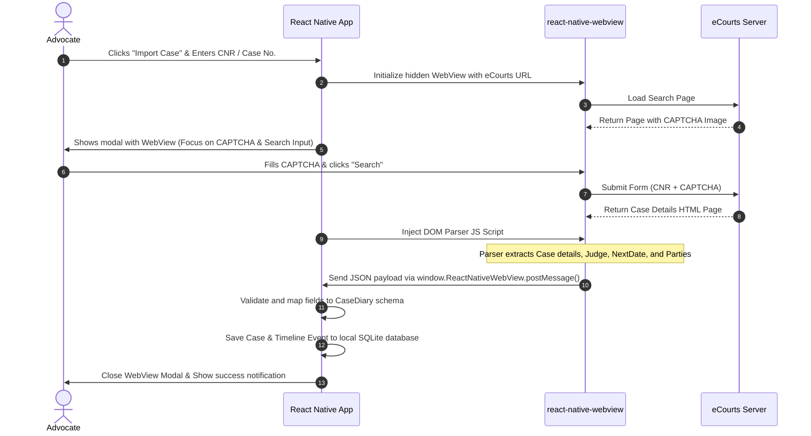

# Implementation Design: Local eCourts Case Importer

This document details the system design for importing case details directly from the public **eCourts services portal** into CaseDiary's offline SQLite database, running entirely within the advocate's mobile device.

---

## 🏗️ Architectural Overview

To prevent central IP blocking and avoid expensive OCR/CAPTCHA bypass servers, we utilize a **User-Assisted WebView Scraper**. The advocate provides the manual input for the CAPTCHA, and the app automates the search submission and parses the HTML results page using injected JavaScript.



---

## 🛠️ Component Design

### 1. UI Components (`eCourtsImportModal.tsx`)
We will create a modal containing the WebView. For better user experience, we crop/scroll the WebView to focus only on the CAPTCHA and Search action elements, or show the full mobile-friendly eCourts webpage directly in a bottom sheet.

### 2. DOM Parser Script (`ecourtsParser.js`)
We inject a JavaScript string into the WebView when the page URL contains the results identifier (e.g. `/cases/` or form action results).

```javascript
const ecourtsParserJS = `
  (function() {
    try {
      // 1. Identify if case details table is loaded
      const caseTable = document.querySelector('.case_details_table') || document.querySelector('table');
      if (!caseTable) return;

      const caseData = {};

      // 2. Extract values based on text content labels
      const cells = caseTable.querySelectorAll('td');
      for (let i = 0; i < cells.length; i++) {
        const text = cells[i].innerText.trim();
        
        if (text.includes('Case Type')) {
          caseData.caseType = cells[i+1]?.innerText.trim();
        } else if (text.includes('Filing Number')) {
          caseData.filingNumber = cells[i+1]?.innerText.trim();
        } else if (text.includes('CNR Number')) {
          caseData.CNRNumber = cells[i+1]?.innerText.trim();
        } else if (text.includes('Next Hearing Date')) {
          // Extract date from string, e.g., "12-10-2026 (Hearing)"
          const rawDate = cells[i+1]?.innerText.trim();
          caseData.NextDate = rawDate ? rawDate.split(' ')[0] : null;
        } else if (text.includes('Petitioner')) {
          caseData.FirstParty = cells[i+1]?.innerText.trim();
        } else if (text.includes('Respondent')) {
          caseData.OppositeParty = cells[i+1]?.innerText.trim();
        }
      }

      // 3. Post extracted JSON back to React Native
      window.ReactNativeWebView.postMessage(JSON.stringify({
        status: 'success',
        data: caseData
      }));
    } catch (e) {
      window.ReactNativeWebView.postMessage(JSON.stringify({
        status: 'error',
        message: e.toString()
      }));
    }
  })();
`;
```

---

## 🔒 Security & Policy Alignment

> [!IMPORTANT]
> **Regulatory and Technical Safeguards**
> - **Self-use exemption**: Because advocates are querying their own cases on behalf of clients using their personal devices, this mimics manual eCourts app usage.
> - **No commercial redistribution**: Data is stored locally in the advocate's offline SQLite database and is not resold or pooled in a central directory.
> - **Rate-limiting**: We enforce a minimum delay between case sync operations to avoid triggering anti-scraping firewalls on the eCourts server.

---

## 🚀 Step-by-Step Implementation Roadmap

1. **Step 1: Install Dependencies**
   - Ensure `react-native-webview` is configured in Expo.
2. **Step 2: Create local parser helper**
   - Implement date mapping to match CaseDiary's timezone-safe `YYYY-MM-DD` standard formats.
3. **Step 3: Build the Import Modal Component**
   - Integrate WebView with active state monitoring (`onNavigationStateChange` and `onMessage`).
4. **Step 4: Connect to SQLite DB**
   - Wire the successful callback payload to pre-fill the form in [AddCase.tsx](file:///e:/Projects/2026/CaseDiaryNew/Screens/Addcase/AddCase.tsx) or write directly to database using `db.addCase(...)`.
