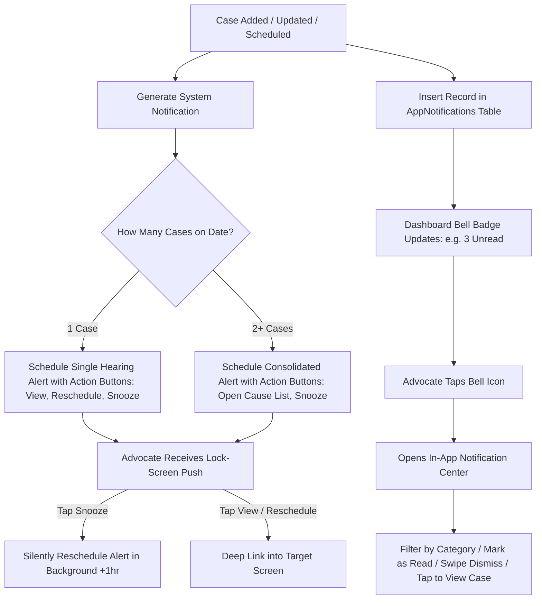

# Specification: World-Class Smart Notification & In-App Activity Center

## 1. Executive Summary & Problem Definition
Advocates need actionable, high-signal alerts about their court hearings, case milestones, and fee activities without suffering from notification fatigue, duplicate buzzes, or missing critical dates. 

This specification defines an integrated system combining:
1. **Interactive Native Lock-Screen Push Notifications**: Action buttons (`View Case`, `Quick Reschedule`, `Snooze 1h/3h`).
2. **Consolidated Multi-Hearing Notifications**: 1 smart summary on the lock-screen when multiple hearings occur on the same date.
3. **In-App Notification Center & Activity Inbox**: Persistent SQLite storage (`AppNotifications`), unread badge counter in header, category filter tabs (`All`, `Hearings`, `Case Updates`, `Fees`), swipe-to-dismiss, and 30-day auto-retention.
4. **100% Offline Privacy & High-Speed Querying**: Zero server dependency, fully driven by local SQLite database.

---

## 2. Decision Log

| Decision ID | Topic | Chosen Decision | Rationale |
| :--- | :--- | :--- | :--- |
| **D1** | **System Architecture** | SQLite-Backed Activity Inbox + Native Notification Action Categories | Maximum reliability, offline-first privacy, instant query filtering, and native OS interaction. |
| **D2** | **Lock-Screen Quick Actions** | `View Case`, `Quick Reschedule`, `Snooze 1 Hr / 3 Hrs` | Direct courtroom utility without manual navigation. |
| **D3** | **Multi-Case Stacking** | Single Consolidated Lock-Screen Alert + Granular In-App Inbox Items | Prevents buzzing the phone multiple times at the same minute while retaining full case granularity inside the app. |
| **D4** | **Access Location** | Header Bell Icon on Dashboard/Home with real-time unread badge | Prominent and discoverable without consuming bottom navigation bar space. |
| **D5** | **Data Retention Policy** | 30-day auto-purge with `Mark All as Read` & Swipe-to-dismiss | Prevents database bloat while keeping recent history accessible. |
| **D6** | **Android Channels** | `hearing_reminders` (High Importance, Sound, Vibrate) & `daily_briefings` (Default) | Proper OS categorization and priority management. |

---

## 3. Detailed Data Model & Architecture

### 3.1 SQLite Schema (`AppNotifications`)
```sql
CREATE TABLE IF NOT EXISTS AppNotifications (
  id INTEGER PRIMARY KEY AUTOINCREMENT,
  title TEXT NOT NULL,
  body TEXT NOT NULL,
  category TEXT NOT NULL,      -- 'hearing' | 'case_update' | 'fee' | 'system'
  case_id INTEGER,
  action_type TEXT,            -- 'single_hearing' | 'hearing_summary' | 'status_change' | 'fee_payment'
  data_json TEXT,              -- JSON metadata (e.g. {"caseId": 12, "hearingDate": "2026-08-25"})
  is_read INTEGER DEFAULT 0,   -- 0: unread, 1: read
  created_at TEXT DEFAULT (STRFTIME('%Y-%m-%d %H:%M:%f', 'NOW')),
  FOREIGN KEY (case_id) REFERENCES Cases(id) ON DELETE CASCADE
);

CREATE INDEX IF NOT EXISTS idx_notifications_category ON AppNotifications(category);
CREATE INDEX IF NOT EXISTS idx_notifications_is_read ON AppNotifications(is_read);
CREATE INDEX IF NOT EXISTS idx_notifications_created_at ON AppNotifications(created_at);
```

### 3.2 Notification Action Categories
```ts
// 1. Single Hearing Category
Notifications.setNotificationCategoryAsync("HEARING_REMINDER_CATEGORY", [
  { identifier: "VIEW_CASE", buttonTitle: "View Case", options: { opensAppToForeground: true } },
  { identifier: "RESCHEDULE", buttonTitle: "Reschedule", options: { opensAppToForeground: true } },
  { identifier: "SNOOZE_1H", buttonTitle: "Snooze 1 Hr", options: { opensAppToForeground: false } },
]);

// 2. Multi-Hearing Consolidated Category
Notifications.setNotificationCategoryAsync("MULTI_HEARING_CATEGORY", [
  { identifier: "OPEN_CAUSE_LIST", buttonTitle: "Open Cause List", options: { opensAppToForeground: true } },
  { identifier: "SNOOZE_1H", buttonTitle: "Snooze 1 Hr", options: { opensAppToForeground: false } },
]);
```

---

## 4. Component & Screen Architecture

### 4.1 `NotificationBellButton.tsx`
- **Location**: Top App Bar in [`Screens/Dashboard/Dashboard.tsx`](file:///E:/Projects/2026/CaseDiaryNew/Screens/Dashboard/Dashboard.tsx).
- **Features**:
  - Bell icon with unread badge counter (e.g., `🔴 3`).
  - Subscribes to database changes or query hooks.
  - Tapping navigates to `NotificationInboxScreen`.

### 4.2 `NotificationInboxScreen.tsx`
- **Location**: Registered in [`Apppro.tsx`](file:///E:/Projects/2026/CaseDiaryNew/Apppro.tsx) / `HomeStack`.
- **Features**:
  - Top bar with "Mark All as Read" & "Clear All".
  - Filter Tabs: `All`, `Hearings`, `Case Updates`, `Fees`.
  - Notification Cards with category icon badge, relative timestamp (`10 mins ago`, `Yesterday`), unread dot, case metadata, and action buttons (`View Case`, `Reschedule`).
  - Swipe-to-dismiss support.
  - Clean empty-state view.

### 4.3 Database Module (`DataBase/appNotificationsDb.ts`)
- CRUD operations:
  - `addNotification(notif: NewAppNotification): Promise<number>`
  - `getNotifications(category?: string): Promise<AppNotificationRow[]>`
  - `getUnreadNotificationsCount(): Promise<number>`
  - `markNotificationAsRead(id: number): Promise<boolean>`
  - `markAllNotificationsAsRead(): Promise<boolean>`
  - `deleteNotification(id: number): Promise<boolean>`
  - `clearAllNotifications(): Promise<boolean>`
  - `purgeOldNotifications(days?: number): Promise<number>` (Defaults to 30 days)

---

## 5. User Workflows


